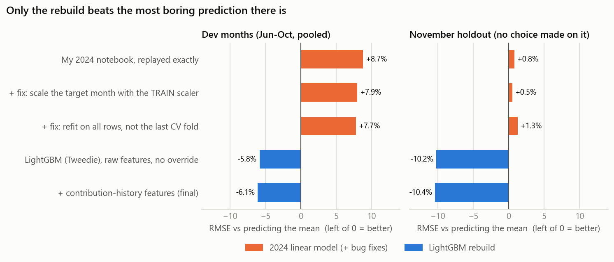
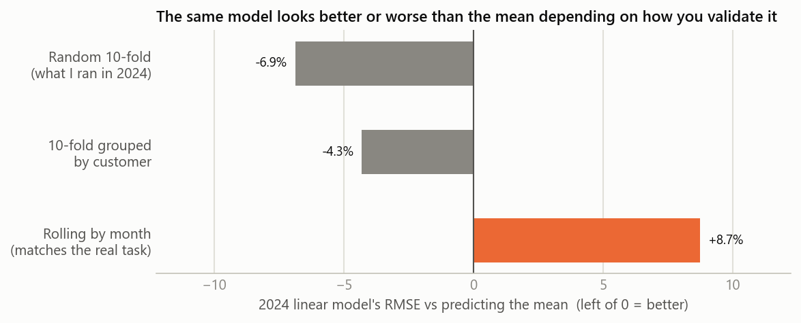
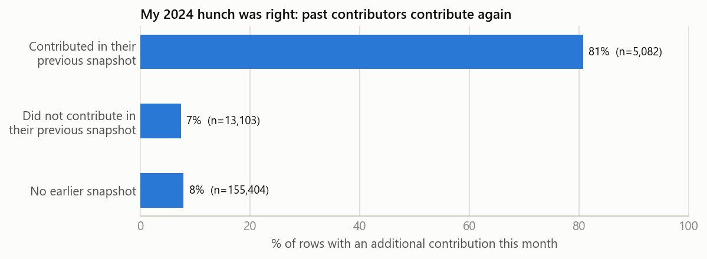
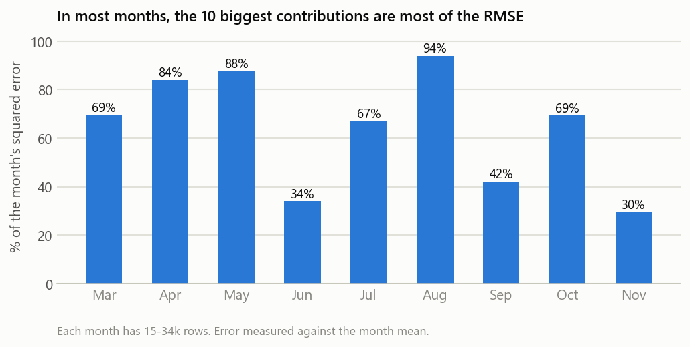
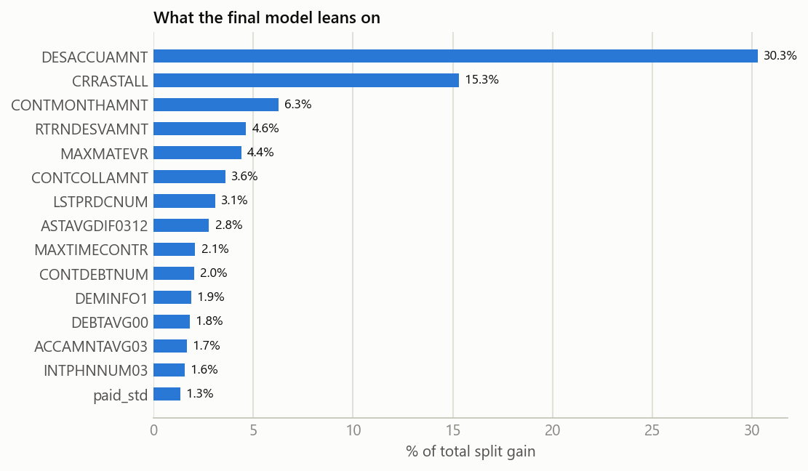

# 🏦 Garanti BBVA BES — What I Got Wrong, and How I Fixed It

**EN —** In May 2024 I entered the Garanti BBVA Data Day case study on Kaggle: predict how much
each customer adds to their private pension (BES) as an **additional contribution** in December 2018,
scored by RMSE. I finished **36th of 51** with a public RMSE of **9,228**. Two years later I went back
to my notebook with one question: *what exactly did I do wrong?* This repo is the answer. It replays
my 2024 notebook exactly, finds six mistakes, measures each one, and rebuilds the model properly.

**TR —** Mayıs 2024'te Kaggle'daki Garanti BBVA Data Day vakasına katıldım. Görev, her müşterinin
Aralık 2018'de bireysel emeklilik (BES) hesabına yatıracağı **ek katkı payını** tahmin etmekti;
metrik RMSE'ydi. **51 kişi içinde 36.** oldum, public RMSE skorum **9.228**'di. İki yıl sonra
notebook'uma tek bir soruyla geri döndüm: *tam olarak neyi yanlış yaptım?* Bu repo o sorunun cevabı.
2024 notebook'umu birebir tekrar çalıştırıyor, altı hata buluyor, her birinin etkisini ölçüyor ve
modeli baştan doğru şekilde kuruyor.


---

## 📊 Results / Sonuçlar

**EN —** Every version is scored the way the real task works: to score month *m*, train only on
months before *m*. June–October are the **dev** months where every choice was made; **November is a
holdout** that no choice was made on. Because raw RMSE numbers mean little here (see 🐋 below), every
row is also shown against the most boring model possible: *predict the training mean for everyone*.

**TR —** Her sürüm, gerçek görevin işleyişiyle aynı şekilde puanlandı: *m* ayını puanlamak için
sadece *m*'den önceki aylarla eğitim. Haziran–Ekim, tüm seçimlerin yapıldığı **dev** ayları;
**Kasım ise hiçbir seçimde kullanılmayan holdout**. Ham RMSE sayıları burada pek bir şey söylemediği
için (aşağıdaki 🐋 bölümüne bakın) her satırı akla gelebilecek en sıkıcı modelle de kıyaslıyorum:
*herkese eğitim ortalamasını tahmin et*.

| # | Version | Dev RMSE | vs mean | Beats mean (of 5 months) | Nov RMSE | vs mean |
|---|---------|:-------:|:-------:|:---:|:-------:|:-------:|
| 0 | Baseline: predict the training mean | 6,817 | — | — | 5,160 | — |
| 1 | **My 2024 notebook, replayed exactly** | 7,413 | **+8.7%** | 2 | 5,201 | +0.8% |
| 2 | + fix: scale the test month with the *train* scaler | 7,357 | +7.9% | 2 | 5,185 | +0.5% |
| 3 | + fix: refit on all rows, not the last CV fold | 7,345 | +7.7% | 2 | 5,227 | +1.3% |
| 4 | LightGBM (Tweedie), raw features | 6,421 | −5.8% | 5 | 4,634 | −10.2% |
| 5 | **+ contribution-history features (final)** | **6,403** | **−6.1%** | **5** | **4,625** | **−10.4%** |

<p align="center"></p>

**EN —** The uncomfortable headline: **my 2024 model was worse than predicting one constant for
everyone.** Fixing its two bugs barely changes that. What changes it is replacing the model.

**TR —** İşin rahatsız edici özeti: **2024 modelim, herkese tek bir sabit sayı tahmin etmekten daha
kötüydü.** İki bug'ını düzeltmek bunu neredeyse hiç değiştirmiyor. Değiştiren şey, modelin kendisini
değiştirmek.

## 🐞 The six mistakes / Altı hata

### 1. I never compared against a baseline / Hiç baseline ile kıyaslamadım

**EN —** Under RMSE the best constant is the mean, so "predict the mean" is the bar any model has to
clear. I never checked. Replayed under honest validation, my notebook loses to it by 8.7% on the dev
months and only beats it in 2 of 5 months. [`src/original.py`](src/original.py) reproduces my notebook
line by line (it matches every prediction the notebook printed), so this is my actual model.

**TR —** RMSE altında en iyi sabit tahmin ortalamadır; dolayısıyla "ortalamayı tahmin et", her
modelin aşması gereken çıta. Ben hiç kontrol etmemişim. Dürüst doğrulamayla tekrar çalıştırıldığında
notebook'um dev aylarında bu çıtanın %8,7 gerisinde kalıyor ve 5 ayın sadece 2'sinde onu geçebiliyor.
[`src/original.py`](src/original.py) notebook'umu satır satır tekrar ediyor (notebook'un yazdırdığı
her tahminle aynı sonucu veriyor); yani bu gerçekten benim modelim.

### 2. My cross-validation told me a comforting story / Çapraz doğrulamam bana rahatlatıcı bir hikâye anlattı

<p align="center"></p>

**EN —** I ran a shuffled 10-fold CV (RMSE 7,015) and read it as progress. On those same folds the
model looks 6.9% *better* than the mean. Two leaks cause that. Shuffling mixes all months, so the model
trains on the future. And 15,412 customers appear more than once, so the same person lands on both
sides of a fold. Validate like the real task (past months → next month) and the sign flips to +8.7%.

**TR —** Karıştırılmış 10-fold CV çalıştırmışım (RMSE 7.015) ve bunu ilerleme sanmışım. Aynı
fold'larda model, ortalamadan %6,9 *daha iyi* görünüyor. Bunun iki sızıntı sebebi var. Karıştırma tüm
ayları birbirine kattığı için model gelecekle eğitiliyor. Ayrıca 15.412 müşteri birden fazla kez
görünüyor, yani aynı kişi fold'un iki tarafına da düşüyor. Gerçek görev gibi doğrulayınca (geçmiş
aylar → sonraki ay) işaret +%8,7'ye dönüyor.

### 3. `scaler.fit_transform(df_test)` / Test verisinde scaler'ı yeniden fit etmek

**EN —** The test month was standardised with its *own* mean and standard deviation instead of the
training ones. The coefficients were therefore applied to features on a different scale (`month`
became 0 everywhere, as if December were July). [`tests/test_pipeline.py`](tests/test_pipeline.py)
shows this bug wrecking an otherwise perfect model.

**TR —** Test ayı, eğitimdekiler yerine *kendi* ortalaması ve standart sapmasıyla ölçeklenmiş.
Katsayılar bu yüzden farklı ölçekteki özelliklere uygulanmış (`month` her yerde 0 olmuş; sanki
Aralık, Temmuz'muş gibi). [`tests/test_pipeline.py`](tests/test_pipeline.py) bu bug'ın kusursuz bir
modeli nasıl bozduğunu gösteriyor.

### 4. The last CV fold's model made my predictions / Tahminleri son CV fold'unun modeli yaptı

**EN —** My CV loop kept overwriting `model` and I never refit it on all the data, so the submission
came from a model that had seen 90% of the rows. Bugs 3 and 4 were real, but fixing both moves the dev
RMSE by less than 1%. **The bugs weren't why I lost; the model was.**

**TR —** CV döngüm `model`'in üzerine yazıp durmuş ve onu hiç tüm veriyle yeniden eğitmemişim;
submission, satırların %90'ını görmüş bir modelden gelmiş. 3. ve 4. bug gerçekti, ama ikisini
düzeltmek dev RMSE'yi %1'den az oynatıyor. **Kaybetmemin sebebi bug'lar değil, modeldi.**

### 5. A good idea in the wrong place / Yanlış yerde iyi bir fikir

<p align="center"></p>

**EN —** After predicting, I overwrote the prediction for returning customers with their last
positive contribution. The hunch was **right**: people who contributed in their previous snapshot
contribute again 81% of the time, against 7% for those who didn't. As a hard override, though, it's a
coin flip under RMSE. Removing it helps on the dev months (+7.7% → +1.7%) and hurts badly on November
(+1.3% → +9.2%), because copying an amount is a big bet on exactly the rows that decide RMSE.
Given to LightGBM as features, the same idea improves *who-will-contribute* ranking (AUC 0.878 →
0.884) but not dev RMSE (−6.1% → −5.9%), so by my own rule it stayed out of the final model
([`reports/checks.csv`](reports/checks.csv)).

**TR —** Tahminden sonra, daha önce görülen müşterilerin tahminini son pozitif katkılarıyla
değiştirmişim. Sezgi **doğruydu**: önceki anlık görüntüsünde katkı yapanlar %81 ihtimalle yine katkı
yapıyor, yapmayanlarda bu oran %7. Ama katı bir override olarak RMSE altında yazı tura. Kaldırınca dev
aylarında iyileşiyor (+%7,7 → +%1,7), Kasım'da ise ciddi kötüleşiyor (+%1,3 → +%9,2); çünkü bir
tutarı kopyalamak, tam da RMSE'yi belirleyen satırlar üzerine oynanmış büyük bir bahis. Aynı fikir
LightGBM'e özellik olarak verildiğinde *kimin katkı yapacağını* sıralamayı iyileştiriyor (AUC 0,878 →
0,884), ama dev RMSE'yi iyileştirmiyor (−%6,1 → −%5,9). Kendi kuralıma göre bu yüzden final modele
girmedi ([`reports/checks.csv`](reports/checks.csv)).

### 6. I trusted a single month / Tek bir aya güvendim

**EN —** My 2024 feature search tried ~1,000 feature combinations, trained on March–October and
scored only on November. Its loudest message was "drop `RTRNDESVAMNT`". Across five dev months that
gain almost disappears (+7.7% → +7.6%). One whale-driven month isn't enough evidence to pick features.

**TR —** 2024'teki özellik aramam ~1.000 kombinasyonu Mart–Ekim ile eğitip yalnızca Kasım üzerinde
puanlıyordu. En yüksek sesle söylediği şey "`RTRNDESVAMNT`'yi çıkar" oldu. Beş dev ayında bu kazanç
neredeyse yok oluyor (+%7,7 → +%7,6). Balinaların belirlediği tek bir ay, özellik seçmek için yeterli
kanıt değil.

## 🐋 Why every improvement looks small / Her iyileşme neden küçük görünüyor

<p align="center"></p>

**EN —** The target is 90% zeros with a tail that reaches 1.26 million. In most months the 10
largest rows (out of 15–34 thousand) are most of the squared error, and in April a single row is
three quarters of it. No feature predicts a seven-figure top-up, so RMSE here mostly measures how
badly you miss the whales. That is why the best model is "only" 6–10% better than a constant, why most of
the leaderboard sat between 8,500 and 9,400, and why I pool five months before believing anything.

**TR —** Hedefin %90'ı sıfır, kuyruğu ise 1,26 milyona kadar uzanıyor. Çoğu ayda (15–34 bin satır
arasından) en büyük 10 satır karesel hatanın çoğunu oluşturuyor; Nisan'da tek bir satır hatanın
dörtte üçü. Hiçbir özellik yedi haneli bir ek katkıyı tahmin edemez, o yüzden burada RMSE büyük
ölçüde balinaları ne kadar kaçırdığınızı ölçüyor. En iyi modelin sabit tahminden "sadece" %6–10 iyi
olması, leaderboard'un çoğunun 8.500–9.400 arasına sıkışması ve bir şeye inanmadan önce beş ayı birlikte
değerlendirmem bundan.

## 🔧 What the rebuild does differently / Yeniden kurulum neyi farklı yapıyor

**EN —**
- **LightGBM with a Tweedie objective**, which is built for "mostly zeros, then a long positive
  tail". Predictions can't go negative, and extreme feature values can't blow a prediction up the way
  they did in the linear model.
- **Missing values stay missing.** 17 of the 36 columns bottom out at exactly 100 (the anonymisation
  seems to add a constant), so my 2024 `fillna(0)` put every gap *below* the real floor.
- **Summaries of the 11 monthly contribution columns** (mean, spread, max, active months, trend,
  ratio to the planned monthly amount).
- **`month` is not a feature.** December never appears in training.
- **Choices on dev months only.** Model, features and the Tweedie power (1.8, from {1.2, 1.5, 1.8})
  were chosen on pooled dev RMSE; November got no vote.

**TR —**
- **Tweedie objective'li LightGBM**: "çoğunlukla sıfır, sonra uzun pozitif kuyruk" şekli için
  tasarlanmış. Tahminler negatife düşemiyor ve uç özellik değerleri, doğrusal modeldeki gibi tahmini
  patlatamıyor.
- **Eksik değerler eksik kalıyor.** 36 sütunun 17'si tam 100'de dipte kalıyor (anonimleştirme sabit bir
  sayı eklemiş gibi); yani 2024'teki `fillna(0)` her boşluğu gerçek tabanın *altına* koyuyordu.
- **11 aylık katkı sütununun özetleri** (ortalama, yayılım, maksimum, aktif ay sayısı, eğilim, planlanan
  aylık tutara oran).
- **`month` bir özellik değil.** Aralık eğitimde hiç yok.
- **Seçimler sadece dev aylarında yapıldı.** Model, özellikler ve Tweedie parametresi
  ({1,2; 1,5; 1,8} içinden 1,8) birleşik dev RMSE'ye göre seçildi; Kasım'ın oy hakkı olmadı.

<p align="center"></p>

## ⚠️ What I can't claim / İddia edemeyeceklerim

**EN —** The test labels were never released, so I can't say what the rebuild would score on the
leaderboard. `python train.py` writes `submissions/submission_final.csv` (and the exact 2024 replay
next to it) for a late submission. One more clue: my 2024 submission predicted an average of
**1,265** per customer for December, 62% above the historical mean of 783; the rebuild predicts
**788**. Under RMSE a biased average costs on every row.

**TR —** Test etiketleri hiç yayımlanmadı; dolayısıyla yeni modelin leaderboard'da ne alacağını
söyleyemem. `python train.py`, geç gönderim için `submissions/submission_final.csv` dosyasını (yanına
da 2024'ün birebir tekrarını) yazıyor. Bir ipucu daha: 2024 submission'ım Aralık için müşteri başına
ortalama **1.265** tahmin etmiş; bu, geçmiş ortalama olan 783'ün %62 üstünde. Yeni model **788**
tahmin ediyor. RMSE altında yanlı bir ortalama her satırda bedel ödetir.

## 🗂️ Project structure / Proje yapısı

```
garanti-bes-forecast/
├── data/raw/                        # train.csv, test_input.csv (not committed, see below)
├── notebooks/
│   ├── 00_original_2024.ipynb       # my competition notebook, untouched (outputs cleared)
│   └── 01_what_went_wrong.ipynb     # the full story, step by step
├── src/
│   ├── config.py                    # paths, dev/holdout months, LightGBM params
│   ├── data.py                      # load + tidy both CSVs
│   ├── original.py                  # the 2024 notebook as a function, one switch per bug
│   ├── features.py                  # contribution summaries + leak-free customer history
│   ├── model.py                     # mean baseline + LightGBM (Tweedie)
│   ├── validation.py                # rolling-origin folds, RMSE, summaries
│   ├── ladder.py                    # every version, 2024 -> final, plus side checks
│   └── figures.py                   # README figures
├── tests/test_pipeline.py           # no-leakage + bug-behaviour tests (synthetic data)
├── reports/                         # results.csv, checks.csv, figures/
├── models/metrics.json
├── train.py                         # runs everything end to end (~3 min on a laptop CPU)
└── requirements.txt
```

## 🚀 Getting started / Başlangıç

**EN —** The data belongs to a private Kaggle competition (`garanti-bbva-data-day-case-study`), so
it is not in this repo. If you have access, put `train.csv` and `test_input.csv` into `data/raw/`.
The tests run without it.

**TR —** Veri, özel bir Kaggle yarışmasına (`garanti-bbva-data-day-case-study`) ait olduğu için bu
repoda yok. Erişiminiz varsa `train.csv` ve `test_input.csv` dosyalarını `data/raw/` içine koyun.
Testler veri olmadan da çalışıyor.

```bash
git clone https://github.com/derinteke/garanti-bes-forecast.git
cd garanti-bes-forecast

python -m venv .venv
source .venv/bin/activate            # Windows: .venv\Scripts\activate
pip install -r requirements.txt

pytest -q                            # 8 tests, no data needed
python train.py                      # full ladder + final model + figures + submissions
jupyter notebook notebooks/01_what_went_wrong.ipynb
```

## 🔭 Where I'd take it next / Bundan sonrası

**EN —** First, a late submission to replace "I can't claim" with a real leaderboard number.
Then I'd model the two questions separately: *will this customer contribute?* (where the history
features clearly help) and *how much, if they do?*, with the second part trained on a loss that
isn't at the mercy of a handful of seven-figure rows.

**TR —** İlk iş, "iddia edemem" kısmını gerçek bir leaderboard sayısıyla değiştirmek için geç
gönderim yapmak. Sonra iki soruyu ayrı ayrı modellerdim: *bu müşteri katkı yapacak mı?* (geçmiş
özelliklerinin açıkça işe yaradığı kısım) ve *yaparsa ne kadar?* İkinci kısmı da birkaç yedi haneli
satırın insafına kalmayan bir kayıp fonksiyonuyla eğitirdim.

## 📚 Data / Veri

**EN —** Garanti BBVA Data Day case study (Kaggle, 2024): 173,589 anonymised month-end snapshots of
155,404 BES customers (March–November 2018) with anonymised banking and pension-plan features. The test set is 16,978 customers in December 2018.

**TR —** Garanti BBVA Data Day vaka çalışması (Kaggle, 2024): 155.404 BES müşterisine ait, 173.589
anonimleştirilmiş ay sonu anlık görüntüsü (Mart–Kasım 2018); anonimleştirilmiş bankacılık ve emeklilik
planı özellikleri içeriyor. Test seti, Aralık 2018'deki 16.978 müşteri.

## 📄 License

MIT.
